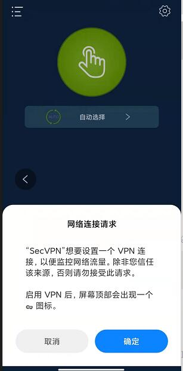

# app需要的权限
    <uses-permission android:name="android.permission.INTERNET" />
    <uses-permission android:name="android.permission.FOREGROUND_SERVICE" />
# 启动vpn services前, activity需要调用VpnService.prepare获取用户授权
**该权限只需授权一次, app重新安装前都有效.**



# SDK嵌入流程
* step
  ```kotlin
  sdk使用的
  compileSdkVersion = 31
  minSdkVersion = 21
  targetSdkVersion = 31
  buildToolsVersion = "30.0.3"
  kotlin_version = "1.5.31"
  
  class VpnApp : Application() {
    override fun onCreate() {
        super.onCreate()
        VpnlibCore.initialize(this)   //<----初始化sdk
    }
  }

  重要结构体
  class VpnServer constructor(
    var country: String,    // vpn server 国家
    var title: String,      // vpn server title
    var ip: String,         // vpn server ip
    var port: Int           // vpn server port
  ){}

  // 当前VPN状态
  enum class VpnState {
    NotConnect,FetchingServer,Connecting,Connected,Stopping,Stopped,Error
  }
  // VPN连接信息数据
  class VpnStatistics : Serializable {
    var vpnState: VpnState = VpnState.NotConnect    // 状态
    var vpnServer: VpnServer? = null                // 服务器
    var totalRecvBytes: Long = 0                    // 总接收字节
    var totalSendBytes: Long = 0                    // 总发送字节
    var recvBytes1S: Long = 0                       // last 1 second 接收字节
    var sendBytes1S: Long = 0                       // last 1 second 发送字节
    var maxRecvSpeed1S: Long = 0                    // 最大接收速度
    var maxSendSpeed1S: Long = 0                    // 最大发送速度
    var connectedTimestamp: Long = 0                // 连接成功时的时间戳
  }

  功能函数
  // 连接vpn, country=all/us/sg/de/fr 等
  VpnlibCore.connectAutoVpn(context, country)  
  // 断开vpn
  VpnlibCore.disconnectVpn(context)
  VpnlibCore.setDisableVpnPackageList(list)           // 设置包名白名单,走本地流量
  VpnlibCore.getDisableVpnPackageList():Set<String>   // 获取当前包名白名单

  SDK才用jetpack的livedata方式传递数据
  具体用法参照 SampleVpn的HomeAcvitity

  VpnlibCore.vpnConnectedEvent                 // vpn连接成功时的event,只发送一次
  VpnlibCore.vpnDisconnectedEvent              // vpn断开时的event,只发送一次
  VpnlibCore.vpnStatisticLiveData              // vpn连接成功后,每秒发送一次连接信息数据
  VpnlibCore.vpnServerInfoByCountryLiveData    // vpnserver的国家列表数据,获取成功后发送

```